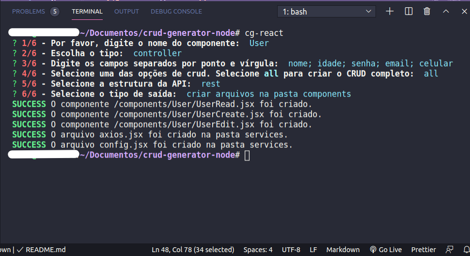

# __Gerador de CRUD para node - Cliente__

__Este é um pacote simples de código aberto gratuito para criar CRUD para React JS__

# Características
- Automatização de operações crud
- Ganho em produtividade;
- Crie um crud completo;
- Crie partes do crud separadamente;
- Uso interativo das bibliotecas `Chalk, inquirer e esm`;
- Desenvolvido utilizando ES6.

# Motivação
Não sei vocês, mas, para mim, umas das coisas mais chatas em programação é criar um crud, principalmente, na questão de update, porque exige que façamos a busca e depois façamos a atualização, ou seja, temos que fazer uma requisição buscando os dados e, em seguida, fazer outra requisição para a atualização usando, geralmente, formulários.

Eu percebi que eu não estava tendo muita produtividade, porque sempre me empatava no U, do CRUD. Sempre o deixava para a última hora. E, sinceramente, eu já programo há muito tempo (não sou um *expert* da programação), mas sempre me empanco nisso, embora goste de fazer.

Foi pensando nisso que veio ao meu pensando a ideia de criar uma CLI capaz de resolver esse problema para mim. A sua usabilidade é muito simples, porque uso o inquirer para interação de usuário com o terminal. 

# Sistemas Operacionais suportados testados.
- Windows
- Linux

# Os formatos das requisições podem ser em:
 - GraphQL
 - API Rest

# Como utilizar

Instale:

```sh
$ npm i -g crud-generator-node-graphql-and-rest-api
```

__Para criar um crud, por exemplo, denominado User, com os campos: *nome, idade, senha, email e celular*, siga estes passos:__

Na raiz do projeto React Js, execute o comando:

```sh
$ crud-generator-node
```

- Na opção __1/5__, digite __User__
- Na opção __2/5__, escolha __controller__ e aperte enter
- Na opção __3/5__, digite os campos separados por ponto e vírgula, assim: __nome; idade; senha; email; celular__
- Na opção __4/5__, escolha __all__
- Na opção __5/5__, escolha __restapi__

__Em seguida__, será criada duas pastas caso não existam:
- components
- services



## A estrutura final é esta:


```
raíz do projeto:
├── components/                 # A pasta components, onde os componentes ficarão
|   ├── User/                   # O novo componente criado
|   |   ├── UserCreate.js/      # O arquivo para criar
|   |   ├── UserEdit.js/        # O arquivo para editar
|   |   └── UserRead.js         # O arquivo para listagem
├── services/ 
|   ├── api.js/                 # O arquivo axios
|   └── config.js               # Arquivo de configuração do sistema.
└── ...
```

A estrutura acima pode ser refeita de acordo com as suas necessidades.